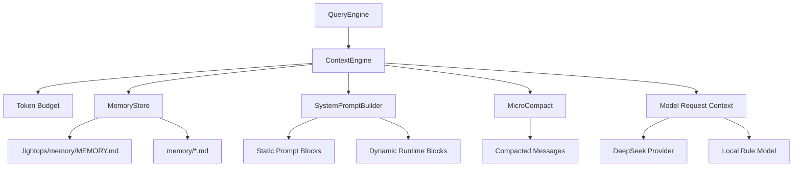

# LightOps Agent 上下文工程设计

本文档设计 LightOps TUI Agent 的上下文工程体系。目标是让 agent 在长时间运维、排障、部署、回滚和本地修复协作中保持稳定工作记忆，同时控制 token 成本、避免过期记忆误导、保护生产安全。

当前实现代码：

- `apps/cloud-agent-tui/src/query/context/context-engine.mjs`
- `apps/cloud-agent-tui/src/query/context/system-prompt-builder.mjs`
- `apps/cloud-agent-tui/src/query/context/memory-store.mjs`
- `apps/cloud-agent-tui/src/query/context/token-budget.mjs`

## 1. 设计目标

LightOps 的上下文工程不是单纯“把更多内容塞进 prompt”，而是解决五个问题：

- 模型每轮都知道自己的产品角色、生产安全边界和工具能力。
- 用户项目的长期知识可以跨会话保留。
- 会话变长后不会因为工具输出和历史消息导致 prompt too long。
- 线上事故链路中的关键证据不会在压缩中丢失。
- DeepSeek/OpenAI-compatible provider 没有精确 token 计数时，仍能用近似预算稳定运行。

## 2. 总体架构



每轮自然语言输入的上下文构建流程：

```text
messages + tools + sessionId
  ↓
读取最新 user query
  ↓
MemoryStore 召回相关记忆
  ↓
SystemPromptBuilder 组装静态块 + 动态块
  ↓
MicroCompact 清理旧工具结果
  ↓
TokenBudget 估算上下文大小
  ↓
必要时插入 compact_boundary 并裁剪历史
  ↓
返回 systemPrompt、messages、contextStats
```

## 3. System Prompt 动态组装

System Prompt 拆成两类块：

- 静态块：身份、生产安全规则、输出风格。内容稳定，未来适合 prompt cache。
- 动态块：当前目录、日期、工具列表、token 预算、记忆索引、相关记忆。每轮可能变化。

当前 builder 会生成：

- `identity`
- `safety`
- `style`
- `boundary`
- `runtime`
- `tools`
- `memory-index`
- `relevant-memory`

其中 `__LIGHTOPS_SYSTEM_PROMPT_DYNAMIC_BOUNDARY__` 是内部边界标记，渲染给模型前会移除。它的意义是为未来 prompt cache 做准备：边界前的稳定内容可以独立缓存，边界后的动态内容每轮重新计算。

### 3.1 为什么不用单个字符串

单个 system prompt 字符串会让任何一个动态字段变动都破坏整个缓存前缀。例如日期、工具列表、当前目录、记忆召回结果都会变化。分块后可以做到：

- 静态块长期稳定。
- 动态块按需重算。
- 日后适配 Anthropic prompt cache 或其他 provider cache 时更容易。
- 便于调试每个 section 对 token 的贡献。

### 3.2 Prompt 内容边界

静态块只放不会因会话变化的规则：

- LightOps 的产品身份。
- 生产安全原则。
- 专用工具优先原则。
- 输出风格。

动态块放运行时信息：

- 当前工作目录。
- 当前日期。
- 注册工具清单。
- 上下文预算。
- 记忆索引和相关记忆。

禁止把这些动态信息放到静态块：

- enabled tools。
- 当前 session id。
- 最近事故。
- 当前 git 状态。
- 用户本轮问题。
- 记忆召回结果。

这些字段如果进入静态块，会造成大量缓存变体。

## 4. 项目记忆系统

LightOps 采用文件级记忆，不引入数据库和向量存储。

目录：

```text
.lightops/memory/
  MEMORY.md
  user_xxx.md
  feedback_xxx.md
  project_xxx.md
  reference_xxx.md
```

`MEMORY.md` 是入口索引，每次上下文构建都会读取，但有上限：

- 最多 200 行。
- 最多 25KB。

记忆文件使用 frontmatter：

```markdown
---
name: Rollback Policy
description: rollback production execute plan policy
type: project
---

Rollback execute must be separated from rollback plan.
```

支持四类记忆：

- `user`：用户长期偏好、角色、工作习惯。
- `feedback`：用户对 agent 行为的纠正和确认。
- `project`：不能从当前代码实时推导出的项目背景。
- `reference`：外部系统、文档、平台约束。

### 4.1 记忆保存原则

只保存“无法从当前项目状态实时推导”的内容。

应该保存：

- 用户明确偏好。
- 已验证的排障流程。
- 生产环境特殊约束。
- 第三方平台规则。
- 用户确认过的协作方式。

不应该保存：

- 当前代码结构。
- 当前文件内容。
- git 状态。
- 可以通过 `rg` 或文件读取实时获得的信息。
- API key、密码、token。

### 4.2 相关记忆召回

当前实现使用轻量关键词召回：

```text
latest user query
  ↓
scan memory frontmatter
  ↓
name + description + type 关键词打分
  ↓
返回最多 5 条
```

后续可以升级成 side query：

- 用轻量模型从 manifest 中选择相关记忆。
- 排除最近已经展示过的记忆。
- 跳过最近工具的使用手册类记忆。
- 输出 JSON schema，保证稳定。

### 4.3 记忆可信度

记忆不是事实数据库，而是过去某个时间点的记录。使用前必须验证：

- 记忆提到文件路径：先检查文件是否存在。
- 记忆提到函数、类、配置项：先搜索。
- 记忆提到生产策略：以当前 Cloud Agent 配置为准。
- 用户要求忽略记忆：本轮当 MEMORY.md 为空。

## 5. Token 预算管理

DeepSeek/OpenAI-compatible provider 当前没有接精确 token 计数，因此使用近似估算。

当前规则：

- 普通文本：约 4 字符/token。
- JSON 内容：约 2 字符/token。
- message role、tool name 额外计入。

预算参数：

- `LIGHTOPS_CONTEXT_WINDOW_TOKENS`，默认 128000。
- `LIGHTOPS_MAX_OUTPUT_TOKENS`，默认 8000。
- 有效输入窗口 = context window - min(max output, 20000)。
- warning 阈值 = effective input - 20000。
- auto compact 阈值 = effective input - 13000。
- blocking 阈值 = effective input - 3000。

状态：

- `ok`
- `warning`
- `compact`
- `blocking`

TUI 可以通过 `/context` 查看最近一次构建的：

- estimatedInputTokens
- budget
- status
- memoryFiles

## 6. 上下文压缩策略

本项目采用三层策略。

### 6.1 MicroCompact

目标：清理旧工具结果，保留消息结构。

当前策略：

- 最近 10 个 tool result 保留。
- 更旧的 tool result 替换为 `[Old tool result content cleared by microcompact]`。
- 对 scan 结果只保留 id、summary、score、前 8 个 findings。

好处：

- JSONL transcript 仍保存原始记录。
- 发给模型的上下文更小。
- 工具调用链不被破坏。

### 6.2 Budget Compact

当估算 token 超过 auto compact 阈值时：

- 保留最早 4 条消息作为会话开头。
- 从尾部保留最近消息。
- 插入 system compact boundary。
- 持续裁剪旧历史，直到回到 warning 阈值附近。

当前 compact boundary：

```text
[compact_boundary auto estimatedTokensBefore=... preservedTailMessages=...]
```

后续应升级为结构化对象：

```json
{
  "type": "compact_boundary",
  "compactType": "auto",
  "preCompactTokenCount": 12345,
  "preservedMessageIds": []
}
```

### 6.3 Summary Compact

当前未实现。后续当 Budget Compact 不够时，应调用轻量模型生成摘要：

- 事故时间线。
- 关键证据。
- 已执行工具。
- 尚未解决的问题。
- 本地修复任务状态。
- 不可丢失的部署/回滚决策。

摘要生成后，应重新注入：

- 相关记忆。
- 最近文件/搜索证据。
- 当前 Cloud Agent state。
- 最近 LocalFixTask。

## 7. 与工具系统的关系

上下文工程必须理解工具结果的不同价值。

高价值结果：

- cloud.scan 的 critical finding。
- incident id、severity、status。
- deployment id、service、state、revision。
- rollback plan/execute 结果。
- LocalFixTask id 和 objective。

低价值结果：

- 大段日志。
- 搜索结果的重复行。
- shell.read 的完整 stdout。
- 旧的 state 快照。

因此工具结果应该在工具层和上下文层双重限流：

- ToolRegistry 控制单次工具输出最大字符数。
- ContextEngine 对历史工具结果做 microcompact。

## 8. 与 Local Agent 的关系

云端 TUI 不应该长期记住本地代码事实。代码事实应由本地 Codex/Claude Code 实时读取。

云端上下文应保存：

- 线上现象。
- 事故证据。
- 环境约束。
- 部署和回滚历史。
- LocalFixTask 状态。

本地上下文应保存：

- 代码结构。
- 测试命令。
- 本地修复计划。
- 文件 diff。
- 本地验证结果。

两者通过 LocalFixTask 对齐，而不是共享完整上下文窗口。

## 9. 安全设计

上下文工程也有安全边界：

- API key 不进入 memory。
- Secret 不进入 system prompt。
- 工具结果进入上下文前必须脱敏。
- 用户要求忽略记忆时，不能引用、比较或提及记忆内容。
- 记忆中的事实必须验证后再用于生产建议。
- dangerous 工具执行前必须依赖当前工具结果，而不是历史记忆。

## 10. 当前落地能力

已经落地：

- 动态 system prompt blocks。
- 静态/动态边界标记。
- 文件级 memory index。
- frontmatter memory 文件扫描。
- 关键词相关记忆召回。
- 近似 token 预算。
- microcompact 工具结果。
- 自动 compact boundary。
- QueryEngine 每轮记录 contextStats。
- TUI `/context` 查看最近上下文状态。

尚未落地：

- 由模型自动写入 memory。
- side query 智能记忆召回。
- 精确 token count。
- API summary compact。
- pre/post compact hooks。
- compact 后恢复最近文件和工具发现。

## 11. 建议实施顺序

下一阶段建议：

1. 增加 `/memory` 命令：查看 MEMORY.md、列出记忆、手动新增记忆。
2. 增加 `memory.write` 工具，但默认需要用户确认。
3. 增加 session summary compact，先用 DeepSeek 生成摘要。
4. 给 tool_result 添加唯一 toolCallId，压缩时保持 tool_use/tool_result 对齐。
5. 增加 context audit 文件，记录每轮 systemPromptBlocks 的 id 和 token 估算。
6. 给 Cloud Agent 的事故、部署、回滚结果做专用 compact 策略。
7. 增加“忽略记忆”本轮开关。

## 12. 验收脚本

当前新增：

```bash
node apps/cloud-agent-tui/scripts/context-engine-smoke.mjs
```

它会验证：

- MEMORY.md 初始化与加载。
- frontmatter 记忆解析。
- 根据 rollback 查询召回相关记忆。
- system prompt 包含静态安全规则和相关记忆。
- token 估算和 contextStats 正常输出。

## 13. 结论

LightOps 的上下文工程应该保持“少而准”：云端 agent 记住生产证据和协作规则，本地 agent 读取代码事实。System Prompt 负责稳定角色和安全边界，MemoryStore 负责跨会话知识，ContextEngine 负责每轮预算和压缩。

最终目标是让 agent 长时间运行时仍然可靠：

```text
长期记忆不漂移
短期上下文不爆炸
工具结果不污染窗口
生产动作不被旧信息误导
本地修复和云端运维边界清晰
```
