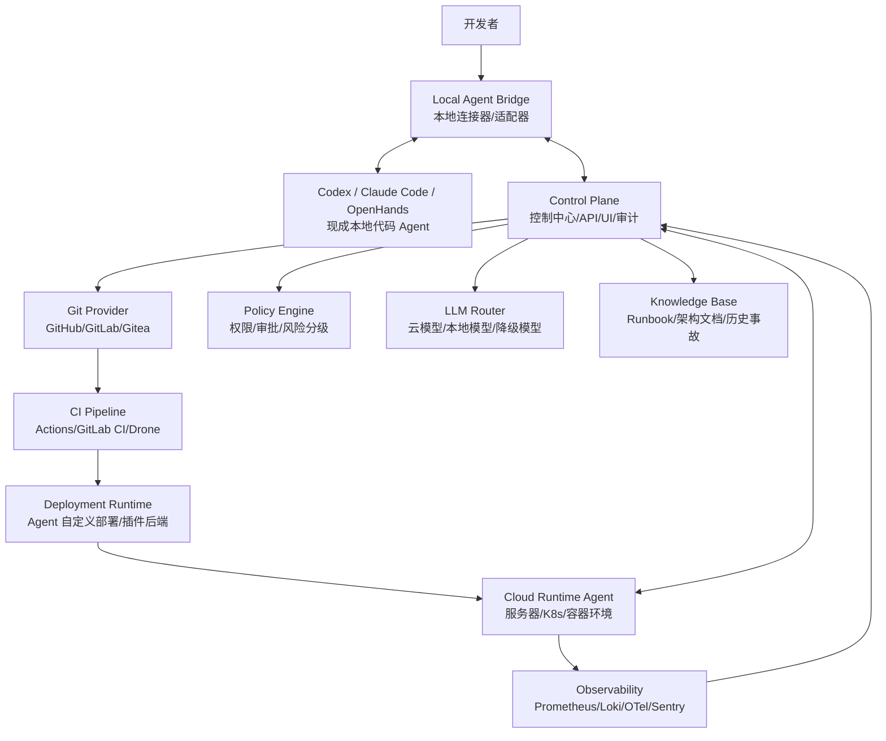
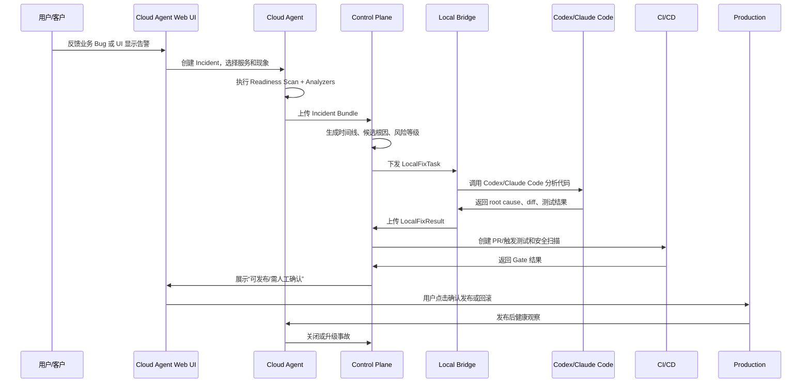
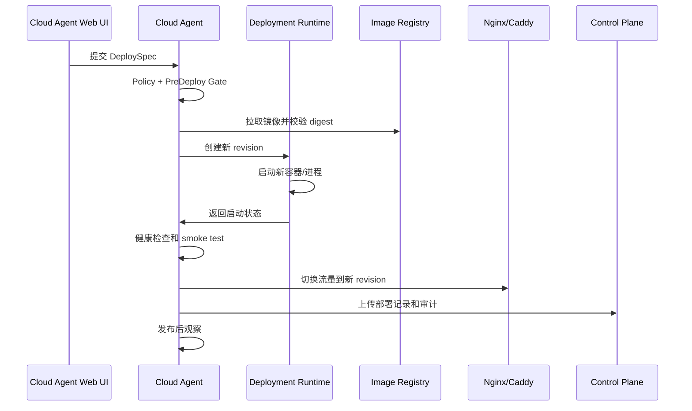
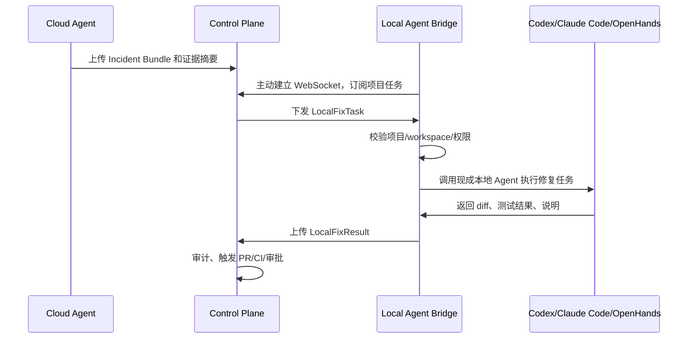
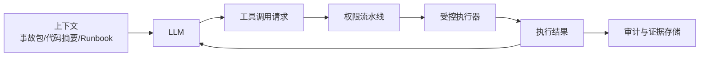
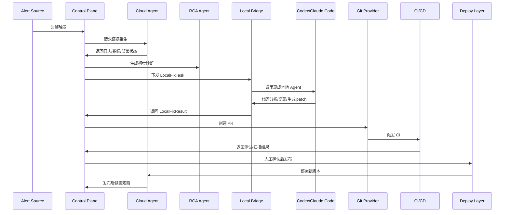

# 轻量级 AI DevOps Agent 平台总体设计

日期：2026-06-29

目标读者：个人开发者、小型团队、需要自托管运维自动化的项目负责人。

## 1. 项目目标

本项目要打造的是一套适用于个人开发者和小型企业的轻量级 Agent 运维平台。它不是传统 AIOps 大平台，也不是单纯的代码生成工具，而是把线上云环境、本地开发环境、代码仓库、CI/CD、监控告警、安全检测串成一个闭环：

1. 线上服务出现异常。
2. 线上 Cloud Agent 自动收集证据。
3. 控制中心生成事故包和初步诊断。
4. Control Plane 把事故包转换成标准本地修复任务。
5. 程序员电脑上的 Codex、Claude Code、OpenHands 等现成本地 Agent 执行代码分析、补丁、测试和 PR。
6. 程序员确认后触发 CI/CD。
7. 发布前执行安全、质量、数据、回滚检查。
8. 发布后观察指标，异常时自动暂停或回滚。
9. 事故复盘沉淀到项目知识库。

核心定位：

> 线上 Agent 负责证据，Codex/Claude Code 等现成本地 Agent 负责代码，控制中心负责通信协议、权限、审计、发布闭环。

原则：

- 默认只读，逐步授权。
- 所有生产写操作必须可审计、可回滚、可人工确认。
- 优先复用成熟开源基础设施，不重复造监控、CI/CD、漏洞扫描器。
- 面向小团队，安装和维护必须轻量。
- Agent 不能直接信任项目仓库、日志、README、工单、网页中的指令，必须把这些内容视为不可信输入。

## 2. 参考资料与开源项目判断

### 2.1 Claude Code / Claude Code 架构解析

参考：

- Claude Code 文档：https://docs.anthropic.com/en/docs/claude-code/overview
- Claude Code Hooks：https://docs.anthropic.com/en/docs/claude-code/hooks
- Claude Code Settings / Permissions：https://docs.anthropic.com/en/docs/claude-code/settings
- Claude Code 架构解析：https://openedclaude.github.io/claude-reviews-claude/zh-CN/overview

可借鉴点：

- Harness 设计：LLM 不直接操作系统，而是通过工具注册表、权限检查、执行器、结果回传完成动作。
- Tool Use Loop：模型提出工具调用，宿主程序执行工具，再把结果注入下一轮。
- Permission Pipeline：工具执行前必须经过权限流水线。
- Hooks：PreToolUse、PostToolUse、Notification、Stop 等 Hook 可以用于拦截、修改、拒绝工具调用。
- 会话持久化：追加式记录对话、工具调用、结果，便于恢复和审计。
- 多 Agent / Subagent：不同任务拆分到独立上下文，减少上下文污染。
- 上下文压缩：日志、代码、监控数据不能原样无限塞给模型，必须分层摘要。

需要增强的地方：

- Claude Code 主要面向本地开发和代码任务，本项目面向生产运维，风险更高。
- 必须增加环境分级、生产审批、回滚策略、密钥脱敏、命令白名单、变更窗口、数据库保护等机制。
- 不能允许 Agent 随意执行 Shell。生产环境必须 fail-closed。

### 2.2 OpenHands

参考：https://github.com/All-Hands-AI/OpenHands

可借鉴点：

- 自托管 coding agent 控制台。
- 可以作为 Developer Agent 的实现参考或后端之一。
- 适合处理代码理解、补丁生成、PR 草稿、测试执行。

不足：

- 更偏软件开发，不是完整生产运维平台。
- 缺少生产发布闸门、运维证据链、云 Agent 权限模型。

### 2.3 OpenDeRisk

参考：https://github.com/derisk-ai/OpenDerisk

可借鉴点：

- AI-SRE、多 Agent RCA 思路。
- 日志、trace、代码、报告 Agent 的角色划分。
- 事故分析报告链路。

不足：

- 对个人开发者和小团队来说偏重。
- 产品化、自托管轻量部署和本地开发协同还需要重做。

### 2.4 K8sGPT

参考：https://github.com/k8sgpt-ai/k8sgpt

可借鉴点：

- Kubernetes 集群扫描、诊断、AI 解释。
- 适合作为 K8s 场景的诊断插件。
- 可以接入 MCP 或作为 Cloud Agent 的工具后端。

不足：

- 只覆盖 K8s 诊断，不负责代码修复和发布闭环。

### 2.5 Robusta

参考：https://github.com/robusta-dev/robusta

可借鉴点：

- Prometheus 告警增强。
- 自动补充日志、图表、K8s 上下文。
- ChatOps、Slack/Teams/Jira 集成。
- 自动 remediation 思路。

不足：

- 偏 K8s 运维和告警增强。
- 不是“本地代码修复 + PR + CI/CD + 生产闸门”的完整闭环。

### 2.6 自定义部署编排 / Argo CD / GitOps

参考：https://argo-cd.readthedocs.io/en/stable/

可借鉴点：

- GitOps 发布模型。
- 声明式配置。
- 发布记录天然可审计。
- 回滚清晰。

设计建议：

- 本项目的核心部署能力不应绑定 Argo CD、Docker Compose 或 Ansible。
- Cloud Agent 应内置一个轻量 `Deployment Runtime`，用户安装 Agent 后，就能在 Web UI 中自定义镜像、端口、环境变量、卷、健康检查、域名、回滚策略，并由 Agent 在云服务器上拉取镜像和启动服务。
- Argo CD、Docker Compose、Ansible、K8s 只作为可选后端插件，不作为产品前置依赖。
- 对个人开发者，默认推荐 `Cloud Agent + Container Runtime`：Agent 直接管理容器、版本、健康检查和回滚。
- 对成熟团队，可选择 GitOps 模式，把 Agent 的发布计划转换成 Git PR 或 Argo CD Application 变更。
- Agent 可以执行部署动作，但必须通过策略、审批和审计；生产高风险动作不能绕过发布 Gate。

### 2.7 Observability / Security 工具

参考：

- OpenTelemetry：https://opentelemetry.io/docs/what-is-opentelemetry/
- Prometheus：https://prometheus.io/docs/introduction/overview/
- Grafana Loki：https://grafana.com/docs/loki/latest/
- OpenTelemetry Collector：https://opentelemetry.io/docs/collector/
- Netdata：https://github.com/netdata/netdata
- Trivy：https://trivy.dev/latest/docs/
- Gitleaks：https://github.com/gitleaks/gitleaks
- Semgrep：https://semgrep.dev/docs/
- OPA：https://www.openpolicyagent.org/docs/latest/

选择原则：

- OpenTelemetry 做标准化 telemetry 接入。
- Prometheus 做指标和告警。
- Loki 做日志。
- Sentry 可选，用于应用异常和 release 关联。
- Trivy/Gitleaks/Semgrep/Checkov/Syft 组成安全扫描栈。
- OPA/Rego 或简化 YAML Policy 负责权限和发布策略。

## 3. 总体架构



### 3.1 三个核心平面

#### Control Plane

控制中心，负责调度、策略、审计、UI、任务流。

不直接执行生产命令，而是通过 Cloud Agent、CI/CD、GitOps、受控工具完成动作。

#### Cloud Runtime Plane

部署到生产环境的轻量 Agent，负责证据采集和受控执行。

只主动出站连接控制中心，不暴露公网控制端口。

#### Developer Runtime Plane

本地开发者机器上不重新实现完整 coding agent，而是运行一个很薄的 `Local Agent Bridge`，再调用 Codex、Claude Code、OpenHands、Aider 等现成工具完成代码分析、修复、测试和 PR。

`Local Agent Bridge` 默认只允许访问用户显式授权的项目目录，并负责把 Control Plane 下发的事故包转换成这些工具能理解的任务，把执行结果、patch、测试报告、PR 链接回传给 Control Plane。

## 4. 关键模块设计

### 4.1 Control Plane

功能：

- 项目管理：服务、环境、仓库、部署方式、负责人。
- Agent 注册：Local Bridge、Cloud Agent、CI Agent。
- 事件中心：告警、异常、部署、回滚、修复任务。
- 事故中心：Incident Bundle、证据链、根因分析、处理进度。
- 策略中心：权限、审批、风险等级、环境隔离。
- 审计中心：所有工具调用、模型判断、人工确认、执行结果。
- 知识库：Runbook、历史事故、架构文档、服务依赖。
- 通知：邮件、Slack、飞书、钉钉、企业微信、Webhook。

推荐技术：

- 后端：Go 或 Python FastAPI。
- 数据库：PostgreSQL。
- 队列：NATS。小规模单机可用 Redis Streams。
- 对象存储：MinIO 或本地文件，用于日志片段、trace、报告附件。
- 前端：React + TanStack Router + shadcn/ui。
- 权限策略：先 YAML Policy，后续可升级 OPA/Rego。

### 4.2 Cloud Runtime Agent

部署位置：

- 单机服务器。
- Docker 宿主机。
- Kubernetes 集群。
- CI/CD Runner。

功能：

- 采集系统状态：CPU、内存、磁盘、网络、进程。
- 采集容器状态：镜像、重启次数、日志、健康检查。
- 采集 K8s 状态：Pod、Deployment、Event、Ingress、Service。
- 采集应用状态：HTTP healthcheck、版本号、build SHA。
- 采集最近部署：发布版本、commit、配置 diff。
- 执行受控动作：重启服务、触发回滚、执行只读诊断命令。

实现建议：

- 语言：Go。
- 通信：mTLS WebSocket 或 NATS。
- 插件接口：Tool Provider。
- 本地缓存：SQLite 或 append-only JSONL。
- 日志脱敏：在发出前做。
- 命令执行：必须走白名单，不允许任意 Shell。

工具示例：

```yaml
tools:
  docker.logs:
    level: L0_READONLY
    args_schema:
      container: string
      since: duration
      tail: integer
  docker.restart:
    level: L2_RECOVERABLE
    requires_approval: false
    allowed_envs: ["dev", "staging"]
  k8s.describe_pod:
    level: L0_READONLY
  k8s.rollout_restart:
    level: L3_PROD_CHANGE
    requires_approval: true
  linux.exec:
    level: L4_HIGH_RISK
    default: deny
```

### 4.3 云端项目探测与诊断设计

现实情况：很多 vibe coding 用户的 Java、Node、Python 项目上线时没有完备埋点，没有 Prometheus 指标，没有 trace，日志也不规范。因此 Cloud Agent 必须支持“无侵入基础诊断 + 半自动增强埋点 + 向导式修复”三层能力。

设计参考：

- Robusta：Prometheus 告警触发后自动补充 pod 日志、图表、相关资源和 remediation 建议。
- K8sGPT：使用 analyzers/filter 扫描 Kubernetes 对象，把 SRE 经验固化为诊断器。
- Netdata：一键安装 Agent，在服务器本地启动 Web Dashboard，自动展示 CPU、内存、磁盘、网络、进程、容器等指标。
- OpenTelemetry Collector：统一接收、处理、导出 traces、metrics、logs，支持 batching、retry、encryption、sensitive data filtering。

本项目的 Cloud Agent 不应要求用户先懂 Linux 和可观测体系，而是安装后自动完成一次 `Cloud Readiness Scan`：

| 探测层 | 无埋点可做什么 | 增强后可做什么 |
| --- | --- | --- |
| 主机 | CPU、内存、磁盘、网络、端口、进程、systemd、OOM、重启 | eBPF/进程级调用、资源趋势、异常检测 |
| 运行时 | Docker 容器、镜像、重启次数、日志、端口映射、healthcheck | 容器级指标、镜像漏洞、资源限制建议 |
| 应用 | HTTP 探活、版本接口、错误日志、启动参数、环境变量缺失检测 | Micrometer/Actuator、OTel SDK、业务指标 |
| 日志 | tail 文件、journalctl、docker logs、错误签名聚类 | 结构化日志、trace_id/request_id 关联 |
| 数据库 | 连接可用性、慢连接、磁盘占用、备份文件新鲜度 | 慢查询、连接池、迁移状态、只读健康检查 |
| 网络 | DNS、TLS 证书、端口连通性、反向代理状态 | 外部依赖探测、SLO 探针 |
| 部署 | 当前 commit、镜像 tag、启动时间、最近发布记录 | GitOps/CI/CD 关联、配置 diff |

#### 4.3.1 Java 项目默认探测点

针对 Java/Spring Boot 项目，即使没有埋点，也可以检测：

- 进程：JVM 进程、启动命令、JAR 路径、工作目录。
- 端口：监听端口、Nginx/网关转发、HTTP health endpoint。
- 日志：`logs/*.log`、systemd journal、Docker logs。
- 错误：`Exception`、`Caused by`、`OutOfMemoryError`、`Connection refused`、`Timeout`、`SQL` 错误。
- JVM：堆内存参数、GC 日志是否开启、线程数、文件句柄。
- Spring Boot：是否暴露 `/actuator/health`、`/actuator/info`、`/actuator/metrics`。
- 配置：环境变量缺失、端口冲突、profile 错误、数据库连接串不可达。
- 依赖：数据库、Redis、MQ、第三方 HTTP API 是否可连。

增强建议：

- Spring Boot 项目自动建议加入 `spring-boot-starter-actuator`。
- 建议开启 `/actuator/health`、`/actuator/info`、`/actuator/prometheus`。
- 建议接入 Micrometer + Prometheus。
- 后续再建议接入 OpenTelemetry Java Agent，做到无代码改动 trace。

Cloud Agent 可以给出“最低成本补齐探测点”的 PR 建议，由 Local Bridge 交给 Codex/Claude Code 修改代码。

#### 4.3.2 诊断器 Analyzer 设计

借鉴 K8sGPT 的 analyzer 模型，Cloud Agent 内置一组轻量诊断器：

| Analyzer | 输入 | 输出 |
| --- | --- | --- |
| `host_resource_analyzer` | CPU/内存/磁盘/网络 | 资源瓶颈、磁盘满、OOM 风险 |
| `process_analyzer` | 进程、端口、systemd | 服务未启动、端口冲突、频繁重启 |
| `docker_analyzer` | 容器状态、logs、inspect | CrashLoop、镜像错误、healthcheck 失败 |
| `java_runtime_analyzer` | JVM 参数、日志、线程、GC | OOM、线程耗尽、连接池异常 |
| `http_probe_analyzer` | HTTP 状态码、延迟、TLS | 探活失败、证书过期、网关错误 |
| `log_signature_analyzer` | 日志片段 | 错误签名、异常堆栈、时间线 |
| `dependency_analyzer` | DB/Redis/MQ/外部 API 探针 | 依赖不可用或高延迟 |
| `deploy_change_analyzer` | 最近发布、配置 diff | 变更关联、可疑 commit |
| `security_baseline_analyzer` | 端口、用户、权限、镜像漏洞 | 暴露面、弱配置、漏洞风险 |
| `business_probe_analyzer` | 用户配置的业务 URL/API | 登录、下单、支付等关键路径异常 |

Analyzer 输出统一结构：

```json
{
  "analyzer": "java_runtime_analyzer",
  "status": "warning",
  "finding": "JVM heap usage high and logs contain OutOfMemoryError",
  "evidence": ["log_ref:ev_001", "metric_ref:ev_002"],
  "confidence": 0.91,
  "suggested_actions": [
    "collect heap dump manually",
    "rollback latest release if issue started after deploy",
    "ask Local Bridge to inspect recent memory-related code changes"
  ],
  "risk_level": "L1_READONLY"
}
```

#### 4.3.3 线上告警与业务 Bug 完整处理流程

典型场景：用户通过 vibe coding 做了一个 Java/Spring Boot 项目，部署到 Linux 云服务器。发布后用户反馈“下单接口 500”，但项目没有完整监控埋点。

完整流程：



处理步骤：

1. 触发：Prometheus/Sentry/webhook 自动触发，或用户在 Cloud Agent Web UI 点击“我遇到了业务 Bug”。
2. 选择现象：接口 500、页面打不开、登录失败、下单失败、支付异常、CPU 高、内存高、磁盘满、服务未启动。
3. 自动采集：Cloud Agent 收集最近 15 分钟日志、进程、端口、容器、systemd、HTTP 探针、最近发布版本。
4. 自动诊断：Analyzer 输出候选问题和证据链。
5. 生成事故包：Control Plane 生成 Incident Bundle。
6. 本地修复：Control Plane 下发 LocalFixTask，Local Bridge 调用 Codex/Claude Code。
7. 代码检查：本地 Agent 根据堆栈、日志、commit、测试定位代码 bug。
8. 补丁生成：生成最小 patch 和测试。
9. 发布前 Gate：CI、测试、安全扫描、配置 diff、回滚目标检查。
10. 用户确认：Web UI 显示“影响范围、修复内容、风险、回滚方案”，用户点确认。
11. 发布观察：Cloud Agent 观察 1/5/10/30 分钟指标和日志。
12. 自动复盘：生成“问题原因、修复方式、以后如何避免”。

#### 4.3.4 Cloud Agent 本地 Web UI

为了服务 vibe coding 用户，Cloud Agent 必须内置一个本地 Web 页面，用户登录 Linux 后一键运行，浏览器打开即可操作，尽量不要求用户理解 Linux 命令。

访问方式：

- 默认监听：`http://server-ip:3717`
- 首次启动只绑定 `127.0.0.1`，用户可通过 SSH tunnel 访问。
- 用户确认后才允许绑定公网 IP。
- 生产建议反代到 HTTPS 域名。

页面信息架构：

| 页面 | 功能 |
| --- | --- |
| 首页 | 服务健康、最近告警、部署状态、Agent 连接状态 |
| 一键体检 | 主机、Docker、Java、端口、日志、依赖、备份、安全基线 |
| 项目接入向导 | 选择项目类型、Agent 自定义部署方式、镜像/进程、日志路径、健康检查 URL |
| 服务地图 | 应用、数据库、Redis、MQ、Nginx、外部 API |
| 告警中心 | 当前告警、历史事故、处理状态、证据链 |
| 业务 Bug 提交 | 用户选择“哪个功能坏了”，Agent 自动创建 Incident |
| 日志查看 | 按错误签名聚类、最近异常、脱敏展示 |
| 发布中心 | 当前版本、上一版本、CI 状态、发布/回滚按钮 |
| 修复建议 | Codex/Claude Code 返回的根因、diff、测试、PR |
| 设置 | Control Plane 地址、token、通知、权限策略 |

首页必须给非运维用户一个清晰答案：

- 服务是否活着？
- 哪个项目出问题？
- 最近是否刚发布？
- 错误是什么？
- Agent 已经收集了什么证据？
- 现在建议做什么？
- 能不能一键回滚？
- 是否需要本地 Codex/Claude Code 修代码？

#### 4.3.5 一键安装与首次接入流程

借鉴 Netdata 的 kickstart 模式，但生产安全上必须提供校验和最小权限说明。

用户体验：

```bash
curl -fsSL https://install.lightops.dev/cloud-agent.sh -o cloud-agent.sh
shasum -a 256 cloud-agent.sh
sudo bash cloud-agent.sh --token <claim-token>
```

安装脚本职责：

1. 检测 OS、CPU 架构、systemd、Docker、Java、Nginx。
2. 创建 `lightops` 系统用户。
3. 安装单二进制 Cloud Agent。
4. 安装 systemd service。
5. 启动本地 Web UI。
6. 打印访问地址和 SSH tunnel 命令。
7. 引导用户打开浏览器完成项目接入。

首次接入向导：

1. 输入项目名称。
2. 选择运行方式：Agent 管理容器、Agent 管理进程、已有 Compose、已有 K8s。
3. 自动扫描候选服务：Java 进程、Docker 容器、Nginx 站点、开放端口。
4. 用户勾选“这是我的项目”。
5. 配置健康检查 URL，例如 `/health` 或 `/actuator/health`。
6. 配置日志路径，Agent 自动推荐。
7. 配置 Git 仓库、镜像仓库和 Agent 部署规格。
8. 执行第一次体检。
9. 生成 `.lightops.yml` 建议配置。
10. 连接 Control Plane 和 Local Bridge。

一键部署业务流程：

1. 用户在本地通过 GitHub Actions/GitLab CI 或本机命令构建镜像。
2. 镜像推送到 Docker Hub、GHCR、阿里云 ACR、腾讯云 TCR 等 registry。
3. 用户在 Cloud Agent Web UI 填写镜像地址、tag、端口、环境变量、域名和健康检查。
4. Cloud Agent 执行预检：registry 登录、镜像 digest、端口冲突、磁盘空间、secret_refs、健康检查配置。
5. 用户点击“部署到生产”。
6. Agent 拉取镜像，创建新 revision。
7. Agent 启动新容器或进程，但暂不切流。
8. Agent 对新 revision 做本地健康检查和 smoke test。
9. 通过后切换 Nginx/Caddy upstream 或更新端口映射。
10. Agent 观察 1/5/10/30 分钟。
11. 异常时按策略回滚到 previous_successful_deploy。
12. 全流程写入审计，Control Plane 和 Web UI 均可查看。

#### 4.3.6 对没有探测点项目的自动补全策略

Cloud Agent 发现项目没有探测点时，不强迫用户手工改代码，而是生成“补齐生产探测点”的任务给 Local Bridge：

Java/Spring Boot 最小 PR：

- 添加 Actuator 依赖。
- 开启 `/actuator/health` 和 `/actuator/info`。
- 添加构建版本信息。
- 添加统一异常日志格式。
- 添加 request_id。
- 添加关键业务接口的 smoke test。
- 添加 Docker healthcheck。
- 添加 README 中的部署与回滚说明。

Node/Python 项目同理：

- 添加 `/healthz`。
- 添加结构化日志。
- 添加 request_id。
- 添加错误处理中间件。
- 添加启动版本信息。
- 添加 smoke test。

这样用户即使不懂 Linux，也能通过“体检 -> 建议补齐探测点 -> 本地 Codex/Claude Code 自动改代码 -> PR -> 上线”的方式，逐步把 hobby 项目变成可生产运维项目。

### 4.4 Cloud Agent Deployment Runtime

本项目的部署能力应以 Cloud Agent 为核心，而不是要求用户预先掌握 Docker Compose、K8s、Ansible 或 Argo CD。用户只要把 Cloud Agent 安装到云服务器，Agent 就可以通过 Web UI 或 Control Plane 接收部署计划，自行拉取镜像、创建运行环境、启动服务、做健康检查和回滚。

核心思想：

> Cloud Agent 是云服务器上的“生产运行时控制器”，负责把用户的镜像和配置变成可运行、可观测、可回滚的服务。

#### 4.4.1 支持的部署后端

| 后端 | 适合用户 | Agent 行为 |
| --- | --- | --- |
| `agent-container` | 默认推荐，个人开发者 | Agent 直接调用 Docker/Podman API 拉镜像、建容器、挂卷、配网络 |
| `agent-process` | Java JAR、Node、Python 单进程项目 | Agent 管理 systemd unit、进程、日志、健康检查 |
| `compose-plugin` | 已有 docker-compose.yml 用户 | Agent 作为 Compose 编排器和审计层 |
| `k8s-plugin` | 已有 K8s 用户 | Agent 创建/更新 Deployment、Service、Ingress |
| `gitops-plugin` | 成熟团队 | Agent 生成 GitOps PR，由 Argo CD 同步 |

MVP 建议优先实现：

1. `agent-container`：拉镜像部署容器。
2. `agent-process`：部署 Java JAR 或 Node/Python 进程。
3. `compose-plugin`：兼容已有 Docker Compose 用户。

Argo CD/K8s 可以放到后续插件，不影响产品核心闭环。

#### 4.4.2 DeploySpec 部署规格

用户在 Web UI 中填写的部署配置最终转换为 `DeploySpec`：

```json
{
  "deploy_id": "dep_20260630_0001",
  "project_id": "payment-api",
  "service": "payment-api",
  "env": "prod",
  "runtime": "agent-container",
  "artifact": {
    "type": "oci_image",
    "image": "registry.example.com/payment-api",
    "tag": "1.8.3",
    "digest": "sha256:..."
  },
  "container": {
    "name": "payment-api",
    "ports": [
      {
        "container_port": 8080,
        "host_port": 8080,
        "protocol": "tcp"
      }
    ],
    "env": {
      "SPRING_PROFILES_ACTIVE": "prod"
    },
    "secret_refs": ["db_password", "redis_password"],
    "volumes": [
      {
        "name": "logs",
        "host_path": "/var/lib/lightops/apps/payment-api/logs",
        "mount_path": "/app/logs"
      }
    ],
    "resources": {
      "cpu_limit": "1",
      "memory_limit": "1024m"
    }
  },
  "network": {
    "domain": "api.example.com",
    "reverse_proxy": "nginx",
    "tls": "managed"
  },
  "healthcheck": {
    "type": "http",
    "url": "http://127.0.0.1:8080/actuator/health",
    "interval_seconds": 10,
    "timeout_seconds": 3,
    "success_threshold": 3,
    "failure_threshold": 3
  },
  "rollback": {
    "strategy": "previous_successful_deploy",
    "keep_revisions": 5,
    "auto_rollback": true
  }
}
```

原则：

- `DeploySpec` 是结构化对象，不允许用户输入任意 shell 作为部署步骤。
- 镜像必须记录 tag 和 digest，避免 tag 漂移导致不可复现。
- secret 只能通过 `secret_refs` 引用，不能明文写入 DeploySpec。
- 每次部署都生成 revision，保留前 N 个成功版本。
- 所有部署动作都必须写入审计日志。

#### 4.4.3 Web UI 部署向导

部署页面不应该让用户写 Linux 命令，而是提供表单：

1. 选择部署类型：容器镜像、Java JAR、Node/Python 进程、已有 Compose、K8s。
2. 填写镜像地址或上传构建产物。
3. 配置端口映射。
4. 配置环境变量和密钥引用。
5. 配置挂载目录。
6. 配置域名和反向代理。
7. 配置健康检查 URL。
8. 配置资源限制。
9. 配置回滚保留版本。
10. 点击“预检”。
11. 预检通过后点击“部署”。
12. 发布后自动观察，失败自动回滚或提示人工处理。

预检内容：

- 镜像是否能拉取。
- digest 是否可解析。
- 端口是否冲突。
- 磁盘空间是否足够。
- 环境变量是否完整。
- secret_refs 是否存在。
- 健康检查 URL 是否可访问。
- Nginx 配置是否可生成并通过语法检查。
- 当前版本是否可回滚。

#### 4.4.4 部署执行流程



失败处理：

- 镜像拉取失败：不影响旧版本，提示 registry/token/镜像名问题。
- 端口冲突：阻断部署，展示占用进程。
- 健康检查失败：停止新 revision，旧版本继续服务。
- 切流失败：回滚 Nginx/Caddy 配置。
- 发布后错误率升高：按策略自动回滚到 previous_successful_deploy。
- 回滚失败：升级为 P0，保留所有日志和现场。

#### 4.4.5 为什么自定义部署是核心能力

对 vibe coding 用户来说，最大的痛点不是写业务代码，而是：

- 不知道怎么把项目长期稳定跑在云服务器。
- 不知道怎么配置端口、域名、HTTPS、环境变量。
- 不知道怎么判断部署是否成功。
- 不知道出问题后怎么回滚。
- 不喜欢长期 SSH 到 Linux 上排障。

因此 Cloud Agent 的价值不只是监控，而是把“部署、体检、告警、修复、回滚”做成一个可点击的生产控制台。Docker Compose、Ansible、Argo CD 都可以作为插件存在，但不能成为用户必须先学会的东西。

### 4.5 Local Agent Bridge 与现成本地 Agent

本项目不重新造一个完整 Local Developer Agent。更合理的做法是：

- Codex、Claude Code、OpenHands、Aider 等现成项目负责本地代码分析、修复、测试、PR 草稿。
- 本项目只实现 `Local Agent Bridge`，负责连接、协议转换、任务下发、结果回传、权限隔离和审计。
- Cloud Agent 不直接连接开发者电脑，所有通信都经过 Control Plane 中转。

`Local Agent Bridge` 的功能：

- 接收 Control Plane 下发的 `LocalFixTask`。
- 校验任务来源、项目绑定、workspace 授权和任务风险。
- 将事故包、证据摘要、代码定位线索、期望输出格式转换成 Codex/Claude Code/OpenHands 的任务 prompt 或命令输入。
- 调用本地现成 Agent 执行代码分析、修复、测试。
- 收集输出：候选根因、patch/diff、测试结果、风险说明、PR 草稿。
- 把结果标准化为 `LocalFixResult` 回传 Control Plane。
- 对本地执行过程做 append-only 审计记录。

实现建议：

- 初期只做 CLI 版 `local-bridge`，不做复杂桌面端。
- 适配器优先级：Codex CLI / Claude Code CLI / OpenHands remote runtime / Aider。
- 任务输入输出统一走 JSON 文件或 stdin/stdout，避免和具体 Agent 深度绑定。
- 本地执行必须限制在项目 workspace。
- 推荐使用 devcontainer 或 Docker sandbox 跑测试。
- Codex/Claude Code/OpenHands 的模型、账号、API key 由开发者自己管理，本项目不托管。
- Control Plane 只保存摘要、diff、测试报告和审计元数据，不默认上传完整本地代码。

`Local Agent Bridge` 需要抽象的本地能力：

- `git.diff`
- `git.log`
- `repo.search`
- `repo.read_file`
- `repo.apply_patch` 或委托现成 Agent 应用 patch
- `test.run`
- `docker.compose_up`
- `dependency.scan`
- `pr.create`

适配器示例：

```yaml
local_agent:
  type: codex
  command: "codex"
  workspace: "D:/projects/payment-api"
  task_input: ".lightops/tasks/{task_id}.json"
  result_output: ".lightops/results/{task_id}.json"
  permissions:
    allow_write: true
    allow_network: false
    require_user_confirm_before_pr: true
```

Claude Code 适配器可利用其 hooks、permissions、settings 思路，在本地执行前后插入 `PreTask`、`PostTask`、`PrePatch`、`PostPatch` 检查；Codex 适配器则以工作区、shell 权限、patch diff 和测试结果为主要边界。

### 4.6 云端与本地 Agent 通信设计

核心原则：

- Cloud Agent 不直接连接 Local Bridge 或程序员电脑。
- Local Agent Bridge 主动出站连接 Control Plane，避免程序员电脑暴露公网端口。
- Control Plane 是任务中转、状态同步、权限审计中心。
- 所有消息必须绑定 `project_id`、`incident_id`、`task_id`、`agent_id`。
- 默认只传事故证据摘要、日志片段引用、代码定位线索，不上传完整生产日志和完整本地代码。

推荐通信方式：

| 场景 | 推荐 |
| --- | --- |
| MVP | HTTPS long polling 或 WebSocket |
| 多 Agent/多项目 | NATS over WebSocket |
| 离线容错 | 本地 append-only queue + 恢复后补发 |
| 文件/大日志 | Control Plane 对象存储 presigned URL |
| 安全认证 | 短期 token + mTLS 可选 |

MVP 推荐：

- Cloud Agent -> Control Plane：mTLS WebSocket 或 HTTPS push。
- Local Bridge -> Control Plane：WebSocket 长连接。
- Control Plane -> Local Bridge：通过 WebSocket 下发任务。
- Local Bridge -> Codex/Claude Code：本地进程调用，不走网络协议。
- Local Bridge -> Control Plane：上传 `LocalFixResult`。

通信链路：



`LocalFixTask` 示例：

```json
{
  "task_id": "lfix_20260630_0001",
  "incident_id": "inc_20260630_0001",
  "project_id": "payment-api",
  "repo": {
    "provider": "github",
    "url": "https://github.com/example/payment-api",
    "expected_branch": "main",
    "suspected_commits": ["abc1234"]
  },
  "workspace_hint": "D:/projects/payment-api",
  "objective": "定位 5xx 激增原因，生成最小修复补丁并补充测试",
  "evidence_summary": {
    "symptom": "checkout endpoint 5xx rate increased after deploy abc1234",
    "logs": ["NullPointerException in CheckoutService.calculateDiscount"],
    "metrics": ["5xx rate 0.2% -> 18%"],
    "traces": ["checkout -> discount-service span failed"]
  },
  "constraints": {
    "no_prod_access": true,
    "no_secret_upload": true,
    "run_tests": true,
    "create_pr": "draft_only"
  },
  "expected_outputs": ["root_cause", "diff", "tests", "risk_notes", "pr_body"]
}
```

`LocalFixResult` 示例：

```json
{
  "task_id": "lfix_20260630_0001",
  "status": "patch_proposed",
  "local_agent": {
    "type": "codex",
    "version": "detected-by-bridge"
  },
  "root_cause": "discount rule can be null after config rollout",
  "changed_files": ["src/CheckoutService.ts", "test/CheckoutService.test.ts"],
  "diff_ref": "object://incident/inc_001/local_fix.diff",
  "test_results": [
    {
      "command": "npm test",
      "status": "passed"
    }
  ],
  "risk_notes": [
    "Fix is limited to null handling and unit test coverage",
    "No database migration"
  ],
  "pr": {
    "mode": "draft",
    "url": "https://github.com/example/payment-api/pull/123"
  }
}
```

安全要求：

- Local Bridge 只接收自己订阅项目的任务。
- 任务必须由 Control Plane 签名。
- 本地执行前必须显示摘要给程序员确认，至少 MVP 阶段如此。
- Bridge 不应把完整本地代码上传到 Control Plane。
- Bridge 可上传 diff、测试输出、依赖扫描结果和 PR 链接。
- 如果本地 Agent 请求生产凭据、`.env`、SSH key、云账号 token，Bridge 必须拒绝。
- 断线后任务状态为 `pending_local_agent`，不影响线上只读诊断。

### 4.7 LLM Router

功能：

- 统一接入云模型和本地模型。
- 按任务类型选模型。
- 降级和重试。
- 脱敏后再发给模型。
- 记录 prompt、工具调用、模型输出摘要。

模型策略：

- 快速分类：小模型。
- 复杂 RCA：强推理模型。
- 代码修复：coding 模型。
- 安全审查：独立 reviewer 模型或规则优先。
- LLM 不可用时：规则诊断 + 事故包保存 + 稍后重试。

## 5. Agent Runtime 设计

### 5.1 工具调用循环



每次工具调用必须包含：

- incident_id
- agent_id
- project_id
- env
- tool_name
- arguments
- risk_level
- policy_decision
- approval_id
- redaction_result
- execution_result
- timestamp

### 5.2 Agent 角色

| Agent | 职责 |
| --- | --- |
| ObserverAgent | 收集日志、指标、trace、部署历史、系统状态 |
| TriageAgent | 判断严重等级、影响范围、通知策略 |
| RCAAgent | 建立假设、收集证据、排序根因 |
| CodeAgent | 关联代码、生成 patch、测试和 PR |
| SecurityAgent | 检查命令风险、密钥泄露、依赖漏洞、越权 |
| DeployAgent | 控制发布、回滚、灰度、发布后观察 |
| ReviewerAgent | 二次审查 AI 生成的代码和运维动作 |
| ReportAgent | 生成事故报告、复盘、知识库条目 |

原则：

- 简单事故走单 Agent 快速路径。
- 复杂事故拆成多 Agent，但必须由 Orchestrator 汇总，不能让多个 Agent 同时争抢生产权限。
- 不同 Agent 使用独立上下文，避免日志污染代码修复上下文。

### 5.3 Hook 体系

必须内置 Hook：

- `PreToolUse`：工具执行前检查权限、环境、参数、敏感信息。
- `PostToolUse`：工具执行后记录审计、脱敏、保存证据。
- `PreDiagnosis`：诊断前注入 Runbook、架构图、历史事故。
- `PostDiagnosis`：校验证据是否足够，避免无证据猜测。
- `PrePatch`：检查工作区、锁定分支、确认事故上下文。
- `PostPatch`：运行测试、格式化、安全扫描。
- `PreDeploy`：执行发布前闸门。
- `PostDeploy`：发布后观察、自动回滚判断。
- `IncidentClosed`：生成复盘和知识库更新。

Hook 结果：

- allow
- deny
- modify
- require_approval
- require_more_evidence
- escalate_to_human

## 6. 权限与安全模型

### 6.1 权限等级

| 等级 | 名称 | 示例 | 默认策略 |
| --- | --- | --- | --- |
| L0 | 只读 | 读日志、读指标、读健康检查 | 自动允许 |
| L1 | 轻量诊断 | 拉取最近日志、执行固定健康探针 | 自动允许 |
| L2 | 可恢复操作 | 重启 staging 服务、清理临时缓存 | 策略允许才执行 |
| L3 | 生产变更 | 回滚、扩缩容、改配置、切流量 | 必须人工确认 |
| L4 | 高危操作 | 数据库迁移、任意 Shell、改安全组 | 默认禁止 |
| L5 | 永久禁止 | 读取密钥原文、上传 .env、执行未知远程脚本 | 永久拒绝 |

### 6.2 生产安全原则

- Agent 默认没有生产写权限。
- 生产命令必须通过策略和审批。
- 所有工具参数必须结构化，不允许自由文本 shell。
- 任何涉及数据库写入、删除、迁移的动作必须人工确认。
- 任何涉及密钥、token、证书的内容必须本地脱敏。
- 仓库 README、Issue、日志、网页、第三方文档都视为不可信输入。
- 工具执行器必须和 LLM 上下文隔离。
- 不允许 Agent 执行 `curl | bash`、远程脚本、未知安装命令。
- 生产动作必须有 rollback_plan。
- 自动修复必须先在 dev/staging 验证。

### 6.3 Policy 示例

```yaml
version: 1
project: payment-api
environments:
  prod:
    default_tool_level: L0_READONLY
    require_human_approval_from: L3_PROD_CHANGE
    deny:
      - linux.exec
      - db.write
      - secret.read_raw
    allow:
      - docker.logs
      - http.probe
      - prometheus.query
      - sentry.issue_read
    deploy:
      require_ci_green: true
      require_security_scan: true
      require_backup_fresh_minutes: 60
      require_rollback_target: true
      post_deploy_watch_minutes: 30
  staging:
    require_human_approval_from: L4_HIGH_RISK
    allow:
      - docker.restart
      - docker.compose_up
      - test.run
```

## 7. 数据模型

### 7.1 Incident Bundle

事故包是 Cloud Agent、Control Plane、Local Bridge 和现成本地代码 Agent 协作的核心数据结构。

```json
{
  "incident_id": "inc_20260629_0001",
  "project_id": "payment-api",
  "service": "payment-api",
  "env": "prod",
  "severity": "P1",
  "trigger": {
    "source": "prometheus",
    "rule": "high_5xx_rate",
    "message": "5xx rate above threshold"
  },
  "time_window": {
    "start": "2026-06-29T10:00:00+08:00",
    "end": "2026-06-29T10:15:00+08:00"
  },
  "runtime": {
    "version": "1.8.2",
    "commit": "abc1234",
    "deploy_id": "deploy_20260629_0950"
  },
  "evidence": {
    "logs": [],
    "metrics": [],
    "traces": [],
    "events": [],
    "deployments": [],
    "config_diffs": [],
    "system_checks": []
  },
  "hypotheses": [],
  "actions": [],
  "approvals": [],
  "result": null
}
```

### 7.2 Evidence 证据对象

```json
{
  "evidence_id": "ev_001",
  "type": "log",
  "source": "loki",
  "time_range": ["2026-06-29T10:00:00+08:00", "2026-06-29T10:05:00+08:00"],
  "summary": "checkout endpoint throws NullPointerException",
  "raw_ref": "s3://incident/inc_001/logs/checkout.log",
  "redacted": true,
  "confidence": 0.92
}
```

### 7.3 Action 审计对象

```json
{
  "action_id": "act_001",
  "incident_id": "inc_20260629_0001",
  "agent": "CloudAgent/prod-01",
  "tool": "docker.logs",
  "args_hash": "sha256:...",
  "risk_level": "L0_READONLY",
  "policy_decision": "allow",
  "approval_id": null,
  "status": "success",
  "started_at": "2026-06-29T10:03:00+08:00",
  "finished_at": "2026-06-29T10:03:02+08:00"
}
```

### 7.4 存储策略

- PostgreSQL：项目、用户、策略、事件、事故元数据、审批、任务状态。
- 对象存储：原始日志、trace、报告附件、测试产物。
- JSONL：Agent 会话、工具调用、流式推理过程，append-only。
- 向量库：Runbook、历史事故、架构文档，可选；MVP 可先用 PostgreSQL full-text search。

## 8. 事故处理链路

### 8.1 标准链路



### 8.2 根因分析方法

RCAAgent 不能直接给结论，必须输出：

- 现象。
- 影响范围。
- 时间线。
- 最近变更。
- 证据。
- 候选根因。
- 置信度。
- 还缺什么证据。
- 推荐动作。
- 回滚建议。

候选根因排序：

1. 最近发布或配置变更。
2. 错误日志新增签名。
3. 指标突变。
4. trace 中耗时或错误节点。
5. 依赖服务异常。
6. 资源耗尽。
7. 外部网络或第三方服务异常。
8. 数据库 schema/data 问题。

## 9. 生产前检测体系

### 9.1 代码质量 Gate

必须支持：

- 单元测试。
- 集成测试。
- E2E 测试。
- 类型检查。
- lint。
- format。
- 代码覆盖率阈值。
- 变更影响分析。
- AI patch 二次审查。

### 9.2 安全 Gate

推荐工具：

- Secret 扫描：Gitleaks。
- 依赖漏洞：Trivy / Grype / OSV-Scanner。
- SAST：Semgrep。
- 容器镜像扫描：Trivy image。
- Dockerfile：Hadolint。
- IaC：Checkov。
- SBOM：Syft。
- License：OSV / deps.dev / FOSSA 可选。

阻断条件：

- 新增高危依赖漏洞。
- 新增明文密钥。
- Docker 镜像包含 critical CVE 且非豁免。
- IaC 打开危险公网权限。
- 生产配置缺少资源限制。
- 迁移脚本不可回滚。

### 9.3 数据 Gate

尤其针对数据库：

- migration dry-run。
- schema diff。
- 是否有 destructive migration。
- 是否需要备份。
- 最近备份是否可用。
- 是否有 rollback migration。
- 是否影响大表。
- 是否需要低峰期执行。
- 是否需要人工 DBA 审批。

### 9.4 部署 Gate

发布前检查：

- CI 全绿。
- 安全扫描通过。
- 镜像构建可复现。
- 配置 diff 已展示。
- 环境变量完整。
- 健康检查 endpoint 可访问。
- readiness/liveness probe 配置。
- rollback target 存在。
- 当前生产状态健康。
- 变更窗口允许。
- 审批已完成。

发布策略：

- 个人项目：蓝绿或快速回滚。
- 小团队：staging -> canary -> prod。
- K8s：Argo Rollouts 可选。
- 默认：Cloud Agent Deployment Runtime + 版本化镜像 + 健康检查 + 自动回滚。
- 可选：已有 K8s/Argo/Compose 用户通过插件接入，不作为默认要求。

### 9.5 发布后观察

观察窗口：

- 1 分钟：进程是否存活、健康检查是否通过。
- 5 分钟：错误率、延迟、重启次数。
- 10 分钟：业务关键指标、队列堆积。
- 30 分钟：和上一版本 baseline 对比。

自动回滚条件：

- 5xx 高于阈值。
- p95/p99 延迟显著上升。
- 错误日志出现新高频签名。
- 容器连续重启。
- 健康检查失败。
- 核心业务指标异常下降。

自动回滚也必须审计，且不能执行数据库反向破坏操作。

## 10. 异常情况矩阵

| 场景 | 处理策略 |
| --- | --- |
| LLM API 不可用 | 降级到规则诊断，保存事故包，稍后重试 |
| 本地 Codex/Claude Code 不可用 | Local Bridge 标记 `local_executor_unavailable`，只生成事故报告和人工修复任务 |
| Control Plane 不可用 | Cloud Agent 本地缓存事件，只执行只读预授权动作 |
| Cloud Agent 失联 | 标记环境不可自动发布，通知开发者 |
| Local Bridge 不在线 | 生成事故包，通知邮件/IM，任务进入 `pending_local_agent` |
| NATS/Redis 不可用 | Agent 本地 append-only 缓存，恢复后补发 |
| 日志过大 | 错误签名聚类、采样、摘要、保留 raw_ref |
| token 超限 | 分层摘要：原始日志 -> 错误簇 -> 证据摘要 |
| 指标缺失 | 降级使用日志、健康检查、系统状态 |
| trace 缺失 | 使用日志 request_id 和时间窗口近似关联 |
| 告警误报 | 标记 false positive，进入规则调优 |
| 权限不足 | 生成需要人工执行的 runbook，不绕过策略 |
| 工具执行超时 | 取消任务，记录 partial result，必要时重试 |
| Agent 版本过旧 | 禁止高风险动作，提示升级 |
| 修复 patch 失败 | 回滚工作区变更，保留失败报告 |
| 测试失败 | 禁止发 PR 或标记 draft PR |
| CI 失败 | 禁止发布，回传失败日志给 CodeAgent |
| 安全扫描失败 | 阻断发布，生成修复任务 |
| 发布失败 | 自动停止，尝试回滚到上一稳定版本 |
| 回滚失败 | 升级 P0，通知人工介入 |
| migration 失败 | 禁止自动重试，人工确认 |
| 发现密钥泄露 | 阻断输出，生成安全事件，建议轮换密钥 |
| 发现 prompt injection | 丢弃恶意指令，只保留数据证据 |
| 供应链风险 | 禁止执行未知安装脚本和 postinstall |
| 时间不同步 | 标记证据低置信度，提示 NTP 检查 |
| 磁盘满 | 可自动清理预定义缓存，禁止删除未知业务文件 |
| CPU/内存耗尽 | 建议限流/扩容/重启，生产动作需策略审批 |
| 第三方 API 故障 | 标记外部依赖异常，建议降级或熔断 |

## 11. 技术选型建议

### 11.1 MVP 技术栈

| 模块 | 选择 |
| --- | --- |
| Control Plane API | FastAPI |
| Control Plane DB | PostgreSQL |
| Queue/Event Bus | NATS 或 Redis Streams |
| Cloud Agent | Go |
| Local Bridge | Python/Node 薄适配器，调用 Codex/Claude Code/OpenHands |
| Web UI | React + shadcn/ui |
| Logs | Loki |
| Metrics | Prometheus |
| Trace | OpenTelemetry |
| Error Tracking | Sentry 可选 |
| CI | GitHub Actions / GitLab CI |
| CD | Cloud Agent Deployment Runtime，插件兼容 Compose/K8s/Argo CD |
| Security | Trivy + Gitleaks + Semgrep |
| Policy | YAML Policy，后续 OPA |
| Storage | PostgreSQL + 本地/MinIO 对象存储 |
| Packaging | Docker Compose |

### 11.2 为什么这样选

- Go 写 Cloud Agent：部署简单、单二进制、适合系统工具。
- FastAPI 写控制中心：迭代快、生态好，适合早期产品。
- NATS：比 Kafka 轻，适合 Agent 消息。
- PostgreSQL：足够稳定，避免早期引入过多组件。
- Cloud Agent Deployment Runtime：个人开发者只需要安装 Agent，就能在 Web UI 中拉镜像、配端口、配域名、健康检查和回滚。
- Docker Compose/Argo CD：只作为已有基础设施用户的进阶插件。
- 不自研监控和漏洞扫描：节约大量时间。

### 11.3 可替代方案

| 场景 | 简单方案 | 进阶方案 |
| --- | --- | --- |
| 消息队列 | Redis Streams | NATS |
| 策略引擎 | YAML | OPA/Rego |
| 日志 | 文件 tail | Loki |
| 指标 | HTTP healthcheck | Prometheus |
| 发布 | Cloud Agent Deployment Runtime | Compose/K8s/Argo CD 插件 |
| 本地连接器 | CLI Local Bridge | 桌面托盘 + IDE 插件 |
| 知识库 | PostgreSQL full-text | pgvector / Qdrant |

## 12. 项目目录建议

```text
lightops-agent/
  apps/
    control-plane/
    web/
    local-bridge/
  agents/
    cloud-agent/
    ci-agent/
  packages/
    protocol/
    policy/
    incident-schema/
    tool-sdk/
  deploy/
    docker-compose/
    helm/
  integrations/
    github/
    gitlab/
    prometheus/
    loki/
    sentry/
    argocd/
  docs/
    architecture.md
    security-model.md
    incident-schema.md
    deployment-gates.md
  examples/
    node-app/
    java-spring-app/
    python-fastapi-app/
```

## 13. 项目接入规范

每个被运维项目放一个 `.lightops.yml`：

```yaml
version: 1
project: payment-api
repository:
  provider: github
  url: https://github.com/example/payment-api
services:
  - name: payment-api
    envs: ["dev", "staging", "prod"]
    runtime: docker
    healthcheck: https://api.example.com/health
    metrics:
      prometheus_job: payment-api
    logs:
      loki_selector: '{app="payment-api"}'
    deploy:
      type: agent-container
      image: registry.example.com/payment-api
      tag_strategy: immutable
      prod_approval: true
      ports:
        - container: 8080
          host: 8080
      healthcheck:
        type: http
        path: /actuator/health
      rollback:
        strategy: previous_successful_deploy
        keep_revisions: 5
    tests:
      unit: "npm test"
      lint: "npm run lint"
      e2e: "npm run test:e2e"
    security:
      secret_scan: true
      dependency_scan: true
      sast: true
    rollback:
      strategy: previous_image
      max_auto_rollback: 1
owners:
  - name: owner
    notify: ["email", "feishu"]
```

## 14. MVP 路线

### Phase 1：诊断闭环

目标：线上告警能自动变成可读事故报告。

范围：

- Control Plane 基础 API。
- Cloud Agent 注册和心跳。
- Prometheus/Sentry webhook。
- 日志/指标/部署信息采集。
- Incident Bundle。
- AI 事故摘要。
- 邮件/飞书通知。

验收：

- 模拟 5xx 告警后，系统能在 1 分钟内生成事故包。
- 报告包含时间线、最近部署、错误日志摘要、影响范围、建议动作。

### Phase 2：本地协同修复

目标：事故包能通过 Local Bridge 下发到 Codex/Claude Code/OpenHands，生成修复建议和 patch。

范围：

- Local Bridge CLI。
- Codex/Claude Code/OpenHands 适配器。
- LocalFixTask / LocalFixResult 协议。
- WebSocket 任务订阅和结果回传。
- 项目 workspace 授权。
- 代码搜索、Git diff、测试运行。
- patch 生成。
- PR 草稿。

验收：

- 给定一个真实 bug，Codex/Claude Code 能通过 Local Bridge 接收事故证据并定位代码。
- 生成 patch 后能运行测试。
- PR 描述包含事故证据、变更说明、风险。
- Local Bridge 断线后任务可恢复，不丢失结果。

### Phase 3：上线前 Gate

目标：AI 修复不能绕过质量和安全检查。

范围：

- CI 集成。
- Gitleaks/Trivy/Semgrep。
- 配置 diff。
- 回滚检查。
- 人工审批。

验收：

- 新增密钥会阻断发布。
- CI 失败会阻断发布。
- 没有 rollback target 会阻断生产发布。

### Phase 4：发布和回滚

目标：支持受控发布和发布后观察。

范围：

- Cloud Agent Deployment Runtime。
- 镜像拉取、端口映射、环境变量、卷、域名、健康检查配置。
- Compose/K8s/Argo CD 作为可选插件。
- 发布后健康观察。
- 自动暂停和回滚。

验收：

- staging 自动发布。
- prod 需人工确认。
- 发布后错误率升高可自动回滚。

### Phase 5：知识库和自学习

目标：历史事故能反哺未来诊断。

范围：

- Runbook 管理。
- 历史事故检索。
- false positive 反馈。
- 根因模板沉淀。

验收：

- 类似事故再次发生时，系统能引用历史处理记录。

## 15. 产品形态

### 15.1 个人开发者

安装：

```bash
docker compose up -d
lightops init
lightops connect github
lightops agent install --target prod
lightops watch payment-api
```

特点：

- 单机控制中心。
- 一个项目或少量项目。
- 默认邮件/IM 通知。
- 手动确认生产发布。

### 15.2 小团队

特点：

- 多用户。
- 多环境。
- 审批流。
- Slack/飞书/钉钉集成。
- GitHub/GitLab PR 集成。
- 审计和复盘。

## 16. 需要避免的误区

- 不要一开始做通用 AIOps 大平台。
- 不要让 Agent 默认拥有生产写权限。
- 不要直接让 LLM 生成 shell 并执行。
- 不要把所有日志原样塞进模型。
- 不要自己重造 Prometheus、Loki、CI/CD。
- 不要自己重造 Codex/Claude Code 这类本地 coding agent。
- 不要忽视密钥脱敏和 prompt injection。
- 不要自动执行数据库 destructive migration。
- 不要把“自动修复”作为第一版卖点，第一版卖点应该是“证据链 + 本地协同修复 + 安全发布”。

## 17. 最终建议

这个项目最有价值的方向是：

> 轻量、自托管、默认安全的 Agent 运维控制中心，把线上故障自动变成本地可修复、可验证、可审计、可上线的任务。

差异化：

- 比 OpenHands 更懂生产环境，同时可以把 OpenHands/Codex/Claude Code 当作本地执行器。
- 比 Robusta/K8sGPT 更懂代码修复。
- 比 OpenDeRisk 更轻量。
- 比传统 CI/CD 多了 Agent 证据链和智能诊断。
- 比直接使用 Claude Code/Codex 更安全，因为它们只负责本地代码任务，生产证据、权限闸门、通信审计和上线 Gate 由本平台控制。

建议第一步先实现“诊断闭环 + 本地修复建议”，不要急着自动上线。等事故包、证据链、权限和 Gate 稳定后，再逐步开放低风险自动修复和生产回滚。
