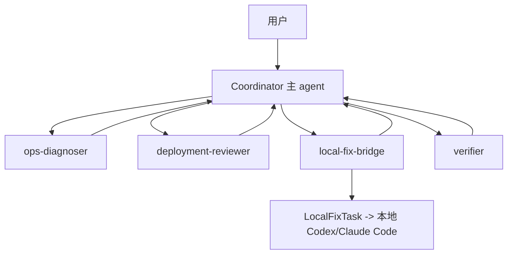

# LightOps Agent 多 Agent 协调设计

本文档设计 LightOps 的多 agent 协调体系。参考 Claude Code 的 AgentTool、fork agent、Coordinator Mode、Swarm/Team、mailbox、worktree 隔离等机制，但按本项目目标裁剪：面向个人开发者和小团队，把“云端生产诊断”和“本地代码修复”打通，而不是在云端构建一个无边界的通用 coding swarm。

当前实现代码：

- `apps/cloud-agent-tui/src/query/agents/agent-definitions.mjs`
- `apps/cloud-agent-tui/src/query/agents/agent-task-store.mjs`
- `apps/cloud-agent-tui/src/query/agents/coordinator.mjs`
- `apps/cloud-agent-tui/src/query/agents/agent-tools.mjs`

## 1. 产品边界

LightOps 的多 agent 不是为了炫技并行，而是为了解决三类真实问题：

- 线上事故需要多个视角：运行时、部署、日志、业务影响、本地修复。
- 主 agent 不应该直接做所有动作，否则上下文会混乱，权限边界会变粗。
- 云端 agent 不应该直接修改用户代码，代码修复应通过本地 Codex/Claude Code 执行。

因此当前采用“星型 Coordinator”：



## 2. 机制选择

LightOps 当前不直接实现完整 Swarm，而是分阶段实现：

| 阶段 | 机制 | 用途 |
| --- | --- | --- |
| 当前 | Coordinator + specialist agents | 拆解、诊断、部署审查、修复交接、验证 |
| 下一步 | async task notification | 长任务不阻塞主对话 |
| 后续 | mailbox | 云端 agent 与本地 bridge 通信 |
| 后续 | local worktree isolation | 本地 Codex/Claude Code 在隔离 worktree 中修复 |
| 暂缓 | long-lived swarm teammates | 需要 Web/TUI 更成熟后再做 |

## 3. Agent 类型

当前内置四个专家：

### 3.1 ops-diagnoser

职责：

- 读取 Cloud Agent state。
- 运行 cloud.scan。
- 汇总线上健康、critical finding、运行时问题。

工具边界：

- `cloud.state`
- `cloud.scan`
- `shell.read`

权限：

- readOnly。

### 3.2 deployment-reviewer

职责：

- 查看部署记录。
- 判断部署/回滚风险。
- 给出发布安全检查建议。

工具边界：

- `cloud.state`
- `cloud.deployments.list`

权限：

- readOnly。

### 3.3 local-fix-bridge

职责：

- 准备本地修复任务。
- 把线上证据转成 Codex/Claude Code 能执行的 objective。
- 不直接在云端修改业务代码。

工具边界：

- `cloud.state`
- `cloud.localFixTask.create`

权限：

- writeScoped。

### 3.4 verifier

职责：

- 汇总验证缺口。
- 建议下一步健康检查。
- 避免未验证就部署或回滚。

工具边界：

- `cloud.state`
- `cloud.scan`

权限：

- readOnly。

## 4. Tool 接口

当前暴露给模型的多 agent 工具：

- `agent.list`
- `agent.plan`
- `agent.run`
- `agent.tasks`
- `agent.task.get`

### 4.1 agent.plan

输入：

```json
{
  "objective": "接口 500，需要诊断、部署审查、本地修复交接"
}
```

输出：

```json
{
  "mode": "coordinator",
  "topology": "star",
  "steps": [
    { "agentName": "ops-diagnoser", "mode": "async" },
    { "agentName": "deployment-reviewer", "mode": "async" },
    { "agentName": "local-fix-bridge", "mode": "async" },
    { "agentName": "verifier", "mode": "async" }
  ]
}
```

设计原则：

- plan 只做拆解，不执行生产动作。
- 每个 worker prompt 必须自包含，不使用“根据上面的发现”这种模糊引用。
- Coordinator 负责综合，不直接转发 worker 结果。

### 4.2 agent.run

输入：

```json
{
  "agentName": "ops-diagnoser",
  "description": "diagnose 500",
  "prompt": "Diagnose latest production 500 evidence.",
  "mode": "sync",
  "isolation": "none"
}
```

输出状态：

- `completed`
- `failed`
- `async_launched`
- `deferred_to_local_agent`

`isolation: "worktree"` 当前不会在云端创建 worktree，而是返回 `deferred_to_local_agent`。这是有意设计：云端生产机器不是代码修改环境，本地 agent bridge 才应该创建 git worktree。

## 5. 生命周期

当前生命周期：

```text
agent.run
  ↓
create task JSON
  ↓
status = queued
  ↓
status = running
  ↓
specialist collects evidence through allowed tools
  ↓
status = completed | failed
  ↓
result persisted
```

异步模式：

```text
agent.run(mode=async)
  ↓
return async_launched immediately
  ↓
background lifecycle updates task JSON
  ↓
future agent.tasks / agent.task.get reads result
```

当前 TUI 进程内异步是轻量实现。生产版需要加入：

- task notification queue。
- session transcript 注入 `<task-notification>`。
- 进程重启后的 resume。
- kill/cancel。

## 6. 持久化

任务存储：

```text
.lightops/agent-tasks/
  agent_20260714112233_abcd1234.json
```

任务结构：

```json
{
  "id": "agent_xxx",
  "agentName": "ops-diagnoser",
  "description": "diagnose 500",
  "prompt": "...",
  "mode": "sync",
  "isolation": "none",
  "status": "completed",
  "progress": [],
  "result": {},
  "error": null,
  "createdAt": "...",
  "updatedAt": "..."
}
```

这和主 session JSONL 分离，原因是：

- agent task 是 runtime task，不等同于主对话消息。
- 后续 Web/TUI 可以单独展示任务列表。
- 本地 bridge 可以读取任务文件。

## 7. Coordinator 与 Swarm 的区别

当前 LightOps 采用 Coordinator，不采用完整 Swarm。

| 维度 | Coordinator | Swarm |
| --- | --- | --- |
| 拓扑 | 星型 | 团队型 |
| 状态 | agent task JSON | team config + mailbox + task board |
| 成员生命周期 | 一次性 specialist task | 长生命周期 teammate |
| 通信 | result/task notification | mailbox by name |
| 适合 | 事故诊断、一次性拆解 | 长期并行项目 |

LightOps 的近期目标是上线运维闭环，Coordinator 足够且更安全。Swarm 可以等 Web/TUI、权限同步、任务白板成熟后再实现。

## 8. Worktree 隔离设计

云端 agent 不直接创建代码 worktree。原因：

- 云端环境通常只有部署产物，不一定有完整源码。
- 用户代码、IDE、测试依赖在本地。
- 云端直接改代码会混淆生产运行环境和开发环境。

正确链路：

```text
线上事故
  ↓
cloud.scan / incident evidence
  ↓
local-fix-bridge
  ↓
LocalFixTask
  ↓
本地 Codex/Claude Code bridge
  ↓
git worktree add
  ↓
本地修复、测试、提交
  ↓
推送代码
  ↓
Cloud Agent 部署验证
```

本项目中 `agent.run({ isolation: "worktree" })` 当前返回：

```json
{
  "status": "deferred_to_local_agent",
  "reason": "Cloud TUI does not mutate local source trees..."
}
```

后续本地 bridge 应实现：

- 创建 `.lightops/worktrees/<slug>` 或用户指定目录。
- 分支命名 `lightops/<task-id>-<slug>`。
- fail-closed 删除策略：无法确认无变更就保留 worktree。
- 有变更时返回 worktree path 和 changed files。
- 无变更时自动清理。

## 9. 权限模型

三层权限：

1. 是否允许启动 agent。
2. agent 拥有哪些工具。
3. 工具执行时走什么权限策略。

当前策略：

- readOnly agent 只能使用 read/safe 工具。
- writeScoped agent 只能创建受控业务对象，例如 LocalFixTask。
- dangerous 生产控制动作不能由 specialist 随意执行。
- worktree 写代码动作延迟给本地 agent。

后续要补：

- agent definition tools 过滤强校验。
- dangerous agent.run 需要 TUI 二次确认。
- coordinator mode 下主 agent 只能 plan/run/list，不直接 cloud rollback/deploy。

## 10. 通信模型

当前：

- sync agent：结果直接作为 `agent.run` tool_result 回到当前 turn。
- async agent：先返回 `async_launched`，后续通过 `agent.tasks` 或 `agent.task.get` 查看。

后续：

- async agent 完成后写入 notification queue。
- QueryEngine 下一轮将 `<task-notification>` 注入上下文。
- 本地 bridge 使用 mailbox/HTTP pull 拉取 LocalFixTask。

推荐通知格式：

```xml
<task-notification>
  <task-id>agent_xxx</task-id>
  <status>completed</status>
  <summary>ops-diagnoser completed</summary>
  <result>...</result>
</task-notification>
```

## 11. 与上下文工程的关系

多 agent 会放大上下文压力，因此必须遵守：

- worker result 要结构化摘要，不直接塞完整日志。
- agent task JSON 保存完整证据引用。
- 主对话只接收 summary、status、next action。
- 长任务用 task id 和 output file 引用。
- Coordinator 综合多个 worker 输出时要去重。

## 12. 当前验收

脚本：

```bash
node apps/cloud-agent-tui/scripts/agent-coordinator-smoke.mjs
```

验证：

- `agent.plan` 能生成多专家计划。
- `agent.run` 能同步运行 `ops-diagnoser`。
- `isolation=worktree` 会 defer 给本地 agent。
- agent task 会持久化。

## 13. 下一步

建议顺序：

1. 增加 `<task-notification>` 队列，并接入 QueryEngine。
2. 给 `agent.run(mode=async)` 增加可恢复 sidechain transcript。
3. 增加 `/agents run` 和 `/agents tasks` TUI 子命令。
4. 增加 `agent.send`，支持给 running/stopped task 追加消息。
5. 增加本地 bridge 协议，让 LocalFixTask 能拉起 Codex/Claude Code。
6. 本地 bridge 实现 git worktree 隔离。
7. 再考虑 Swarm：team config、mailbox、task board。

## 14. 结论

LightOps 的多 agent 核心不是“很多 agent 同时跑”，而是明确职责、边界和结果回流：

```text
Coordinator 负责拆解和综合
ops-diagnoser 负责线上证据
deployment-reviewer 负责发布风险
local-fix-bridge 负责本地修复交接
verifier 负责验证闭环
本地 Codex/Claude Code 负责代码修改
```

这样既能吸收 Claude Code 多 agent 架构的精华，又不会把云端生产环境变成不受控的代码执行场。
