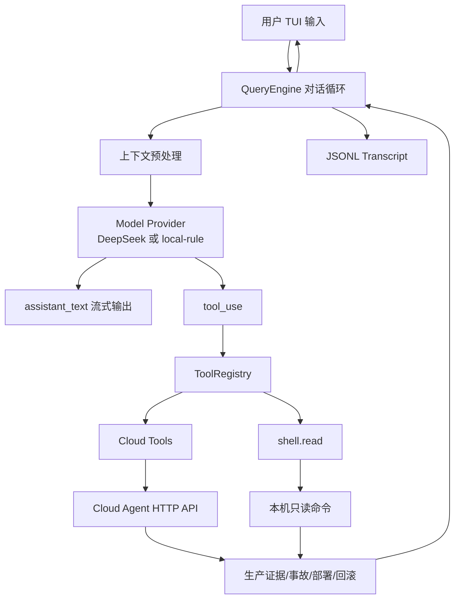

# LightOps Agent 工具系统与对话运转机制设计

本文档整理当前项目的 TUI Agent 运转机制、工具系统设计、安全命令执行策略，以及后续扩展到文件工具、搜索工具、任务管理工具的模块边界。目标不是复刻 Claude Code 的全部能力，而是把适合本项目的核心链路高质量打通：线上 Cloud Agent 负责生产环境观测、诊断、部署和事故固化；本地 Codex/Claude Code 负责代码修改；TUI Agent 在两者之间做可靠的对话编排和工具调用。

## 1. 项目定位

LightOps Agent 面向个人开发者和小型团队，补齐“代码写完之后如何稳定上线、诊断、回滚、反馈给本地开发工具”的最后一块拼图。

当前阶段的产品形态：

- 云端部署一个轻量 Cloud Agent。
- 用户通过 Linux TUI 操作，不强依赖 Web。
- TUI 支持自然语言和命令式输入。
- 真实模型通过 DeepSeek OpenAI-compatible API 接入。
- 没有 API key 时回退到本地规则模型，保证离线可演示。
- 工具调用优先走专用工具，而不是让模型直接随意执行 shell。

## 2. 总体链路



核心原则：

- 模型只做决策，不直接拥有生产权限。
- 工具系统统一执行权限、输入校验、输出预算和审计记录。
- 生产变更通过 Cloud Agent API 和部署策略约束。
- shell 工具只作为辅助诊断工具，默认只允许只读命令。
- 真正的代码修改不放在云端执行，而是通过 LocalFixTask 交给本地 Codex/Claude Code。

## 3. 对话运转机制

当前代码位置：

- `apps/cloud-agent-tui/src/query/query-engine.mjs`
- `apps/cloud-agent-tui/src/query/deepseek-model.mjs`
- `apps/cloud-agent-tui/src/query/local-rule-model.mjs`
- `apps/cloud-agent-tui/src/query/session-store.mjs`

### 3.1 QueryEngine 主循环

每次用户输入都会进入 `submitMessage(content)`：

1. 写入 user message。
2. 初始化本轮 state。
3. 进入 while loop。
4. 检查 maxTurns，防止工具递归失控。
5. 对 messages 做预处理。
6. 调用模型 async generator。
7. 流式渲染 `assistant_text`。
8. 遇到 `tool_use` 后调用 ToolRegistry。
9. 将 `tool_result` 写回消息历史。
10. 如果没有工具调用，本轮 completed。
11. 如果有工具调用，进入下一轮，让模型基于工具结果总结或继续行动。

简化后的逻辑：

```text
user message
  ↓
preprocess(messages)
  ↓
model stream
  ├─ assistant_text → typewriter
  └─ tool_use → ToolRegistry.call()
        ↓
      tool_result
  ↓
if tool_result exists → next turn
else → completed
```

### 3.2 上下文预处理

当前预处理包含三层：

- `microcompact()`：对 scan 这类大对象保留核心字段。
- `applyToolResultBudget()`：工具结果过长时截断。
- `autoCompact()`：消息数量过多时保留头部和尾部，中间用 system message 压缩占位。

设计意图：

- 不把完整日志和完整扫描结果直接塞进模型上下文。
- 保留模型继续推理需要的证据。
- 明确告诉模型哪些内容被截断，避免模型误以为输出完整。

后续增强：

- 增加基于 token 的预算，而不是字符数。
- 对日志类工具采用 tail-first 策略。
- 对事故链路采用结构化摘要：symptom、impact、timeline、evidence、hypothesis、next action。

### 3.3 Model Provider

模型层统一输出两类事件：

```js
{ type: "assistant_text", content: "..." }
{ type: "tool_use", name: "cloud.scan", input: {} }
```

因此 QueryEngine 不关心模型来自哪里：

- DeepSeek provider：真实 streaming + function calling。
- local-rule provider：无 key 时的规则模型。
- 后续可以接 OpenAI、Claude、Ollama、本地模型。

DeepSeek provider 的关键设计：

- 通过 `/chat/completions` 流式读取 SSE。
- 将 OpenAI-compatible 的 `tool_calls` 聚合成项目内部 `tool_use`。
- 将工具名中的 `.` 编码为 `__`，规避函数名字符限制。
- 工具结果暂时转成 user message 回传，后续可以升级为严格 tool role 协议。

### 3.4 会话持久化

SessionStore 使用 JSONL：

- `session_start`
- `message`
- `turn_start`
- `tool_use`
- `tool_result`
- `termination`

好处：

- 易追加，不需要数据库。
- 异常中断后仍能恢复。
- 适合 TUI 和云端小型部署。
- 后续可以被 Web UI 或审计页面直接读取。

## 4. 工具系统总设计

当前代码位置：

- `apps/cloud-agent-tui/src/query/tool-system.mjs`
- `apps/cloud-agent-tui/src/query/cloud-tools.mjs`
- `apps/cloud-agent-tui/src/query/shell-command-tool.mjs`

### 4.1 Tool 定义

每个工具都有统一元数据：

```js
{
  name: "cloud.scan",
  kind: "cloud-diagnostic",
  risk: "read",
  concurrency: "safe",
  maxOutputChars: 8000,
  permission: { mode: "allow" },
  description: "...",
  inputSchema: { type: "object", properties: {}, additionalProperties: false },
  execute: async (input, context) => {}
}
```

字段含义：

- `name`：模型看到的工具名，也是审计主键。
- `kind`：工具类别，如 cloud-read、cloud-write、shell、file、search。
- `risk`：read、write、dangerous。
- `concurrency`：safe 或 serial。
- `maxOutputChars`：工具输出写回上下文前的预算。
- `permission`：本工具默认权限策略。
- `inputSchema`：提供给模型的 JSON schema，同时用于运行时校验。
- `execute`：唯一实际执行入口。

### 4.2 ToolRegistry 职责

ToolRegistry 是从“AI 说要做”到“系统实际执行”的唯一入口：

```text
model tool_use
  ↓
ToolRegistry.has()
  ↓
validateInputShape()
  ↓
permissionPolicy()
  ↓
tool.execute()
  ↓
applyOutputBudget()
  ↓
tool_result
```

它负责：

- 工具注册。
- 工具定义导出给模型。
- 输入 schema 校验。
- 权限策略判定。
- 输出截断。
- secret 字段脱敏。
- 返回统一的 tool result envelope。

这比每个工具自己处理所有事情更容易审计，也更接近 Claude Code 的 Tool 抽象。

### 4.3 为什么专用工具优先

本项目不会让模型默认通过 shell 完成所有事情。原因：

- 云端生产环境风险高，shell 权限边界太粗。
- Cloud Agent API 可以固化审计、幂等、回滚、策略检查。
- 专用工具能返回结构化结果，模型更容易总结。
- 专用工具可以设置不同 risk 和 permission。
- 专用工具可以做领域约束，例如 DeploySpec validation。

推荐优先级：

1. Cloud 专用工具：生产体检、事故、部署、回滚。
2. Search/File 专用工具：代码定位和证据读取。
3. shell.read：只读诊断兜底。
4. shell.write 或 shell.control：以后再做，必须强审批。

## 5. 当前 Cloud Tools

当前工具：

- `cloud.state`
- `cloud.scan`
- `cloud.incident.create`
- `cloud.localFixTask.create`
- `cloud.deployments.list`
- `cloud.rollback.latest`

设计说明：

- `cloud.state` 是只读状态工具，可并行。
- `cloud.scan` 是只读诊断工具，可并行，但输出预算更大。
- `cloud.incident.create` 是写操作，串行执行。
- `cloud.localFixTask.create` 是写操作，串行执行，用于连接本地开发 agent。
- `cloud.rollback.latest` 属于 dangerous，但当前原型仍走 Cloud Agent 后端策略和记录；生产版必须增加二次确认和 API 侧审批。

后续建议新增：

- `cloud.logs.tail`
- `cloud.metrics.snapshot`
- `cloud.healthcheck.run`
- `cloud.deploy.validate`
- `cloud.deploy.execute`
- `cloud.rollback.plan`
- `cloud.rollback.execute`
- `cloud.audit.search`

## 6. BashTool 在本项目中的裁剪设计

用户给出的 Claude Code BashTool 设计重点包括：

- 只读命令自动放行。
- 复合命令需要拆分检查。
- AST 解析失败 fail-safe。
- 长命令自动后台化。
- 输出截断并标记 incomplete。
- 只读命令可并发，有副作用命令串行。
- 专用工具优先于 shell。

本项目当前实现 `shell.read`，采用轻量安全子集。

### 6.1 当前 shell.read 安全策略

允许：

- 简单命令。
- shell=false spawn。
- 只读 allowlist。
- `git status/log/show/diff/branch/rev-parse/remote`
- `node --version`
- `npm --version/list/outdated`
- `rg/grep/find/ls/cat/head/tail/wc/stat/file/jq/awk/sort/uniq`

拒绝：

- 管道 `|`
- 逻辑连接 `&&`、`||`
- 重定向 `<`、`>`
- 分号 `;`
- 子 shell `()`、命令替换、变量展开
- `rm`、`mv`、`cp`、`chmod`、`chown`
- `git push`
- `npm install`
- 任意未在 allowlist 的命令

这样做的原因：

- 零依赖，适合一键部署。
- 先把安全边界做窄。
- 将复杂 Bash AST 解析留给后续版本。
- 对个人开发者的生产诊断来说，常用只读命令已覆盖大部分场景。

### 6.2 与 Claude Code BashTool 的差异

Claude Code 可以做更复杂的 Bash AST 解析；本项目当前阶段只做保守子集。

差异表：

| 能力 | Claude Code BashTool | LightOps 当前 shell.read |
| --- | --- | --- |
| AST 解析 | tree-sitter bash | 简单 argv parser |
| 复合命令 | 拆分检查 | 直接拒绝 |
| 只读自动放行 | 支持 | 支持 |
| 写命令审批 | 支持 | 暂不提供 |
| 自动后台化 | 支持 | 文档设计，未启用 |
| 输出截断 | 支持 | 支持 tail + output budget |
| 并发安全 | 只读可并发 | 只读可并发 |

### 6.3 生产版 BashTool 计划

生产版建议演进为三层：

1. `shell.read`：默认启用，只读，无审批。
2. `shell.background`：仅允许白名单长任务，如 docker logs -f、journalctl -f，并有 taskId。
3. `shell.control`：写操作或危险操作，默认关闭，需要显式策略和 TUI 二次确认。

权限策略：

```text
command
  ↓
parseForSecurity()
  ↓
simple read-only? → allow
  ↓
known safe long-running? → background allow
  ↓
matches configured approval rule? → ask
  ↓
otherwise deny
```

## 7. 输出截断策略

当前截断有两层：

- ToolRegistry `maxOutputChars`
- shell.read 内部 stdout/stderr tail 保留

统一结果字段：

- `isIncomplete`
- `truncatedAtChars`
- `preview`
- `totalBytes`

模型看到这些字段后，应当：

- 不把结果当作完整日志。
- 需要更多证据时使用更精确命令。
- 对日志类问题优先缩小时间窗口、关键词、traceId。

## 8. 并发模型

工具分两类：

- `concurrency: "safe"`：只读、无副作用，可以并行。
- `concurrency: "serial"`：写操作、生产控制操作，必须串行。

当前 QueryEngine 仍是顺序执行工具。这样简单可靠。后续可以优化为：

- 同一轮多个 safe 工具并行。
- serial 工具按顺序执行。
- dangerous 工具强制中断并要求用户确认。

## 9. 文件工具设计

本项目后续不建议云端 agent 直接修改业务代码。代码修改应该发生在本地 Codex/Claude Code，因为用户的 IDE、git、依赖、测试环境都在本地。

但云端和 TUI 可以提供只读文件工具：

- `file.read`
- `file.head`
- `file.tail`
- `file.stat`

如果以后做本地 agent bridge，可以在本地侧提供：

- `file.read`
- `file.search`
- `file.edit`
- `file.write`

安全要求：

- 文件路径必须限制在 workspace root。
- 禁止读取 secret 文件，除非显式授权。
- file.edit 必须输出 diff，并由本地工具执行。
- file.write 默认不提供给云端模型。

## 10. 搜索与导航工具设计

建议新增：

- `search.glob`
- `search.grep`
- `search.symbols`

实现原则：

- 优先调用 `rg`。
- 限制最大结果数。
- 返回结构化 `{ file, line, text }`。
- 搜索工具属于 read/safe，可并发。
- 不让模型直接写复杂 shell grep 命令。

典型输入：

```json
{
  "pattern": "payment failed",
  "path": "src",
  "maxResults": 50
}
```

典型输出：

```json
{
  "matches": [
    { "file": "src/payment/service.js", "line": 42, "text": "throw new PaymentFailed()" }
  ],
  "isIncomplete": false
}
```

## 11. 任务管理工具设计

参考 TodoWrite + Tasks 双轨架构，本项目建议分两类：

### 11.1 Session Todo

TUI 当前会话内的轻量 todo：

- `todo.write`
- `todo.list`
- `todo.complete`

用途：

- 当前排障步骤。
- 临时执行计划。
- 不一定跨设备同步。

### 11.2 LocalFixTask

跨云端和本地 agent 的持久任务：

- 云端由 `cloud.localFixTask.create` 生成。
- 本地 Codex/Claude Code 拉取任务。
- 本地修复、测试、提交、推送。
- 云端继续部署验证。

LocalFixTask 是本项目最重要的“云本协作协议”。

建议字段：

- `id`
- `incidentId`
- `objective`
- `evidence`
- `repo`
- `branch`
- `expectedTests`
- `status`
- `createdAt`
- `updatedAt`
- `resultSummary`

## 12. 生产安全策略

工具系统必须遵守以下规则：

- 默认拒绝危险操作。
- 所有生产变更必须有审计记录。
- 所有部署必须先 validate。
- 回滚必须先 plan，再 execute。
- shell 只读默认放行，写操作默认不开放。
- secret 不进入模型上下文。
- 工具输出必须截断。
- 模型不能伪造工具结果。
- dangerous 工具不能并发。

风险等级：

| risk | 含义 | 默认策略 |
| --- | --- | --- |
| read | 只读诊断 | allow |
| write | 创建事故、创建任务、写审计 | allow 或 ask |
| dangerous | 部署、回滚、删除、重启 | ask 或 deny |

## 13. 当前模块清单

### Query 模块

- `query-engine.mjs`：多轮对话和工具循环。
- `deepseek-model.mjs`：真实模型 provider。
- `local-rule-model.mjs`：离线规则模型。
- `session-store.mjs`：JSONL 会话存储。
- `typewriter.mjs`：流式输出渲染。

### Tool 模块

- `tool-system.mjs`：通用工具注册、输入校验、权限策略、输出预算。
- `cloud-tools.mjs`：生产运维专用工具。
- `shell-command-tool.mjs`：只读命令诊断工具。

### Cloud Agent 模块

- `scan-service.mjs`：主机、运行时、日志、健康检查。
- `incident-service.mjs`：事故创建、本地修复任务生成。
- `deployment-service.mjs`：DeploySpec 验证、部署记录、回滚记录。
- `container-runtime.mjs`：受控容器执行器。
- `policy.mjs`：生产策略。
- `file-store.mjs`：轻量 JSON 文件存储。

## 14. 后续实施顺序

建议下一阶段按这个顺序做：

1. 增加 `cloud.logs.tail` 和 `cloud.metrics.snapshot`。
2. 给 `cloud.rollback.latest` 拆成 `rollback.plan` 和 `rollback.execute`。
3. 增加 TUI 二次确认协议，让 dangerous 工具不能被模型直接执行。
4. 增加 `search.grep` 和 `file.read`，优先服务本地任务定位。
5. 增加 Todo 工具，让模型在复杂事故中维护排障计划。
6. 增加后台任务管理：`task.start`、`task.status`、`task.cancel`。
7. 给 DeepSeek provider 使用严格 tool result role。
8. 增加 tool audit JSONL，和 session transcript 分开存。

## 15. 验收标准

当前阶段验收：

- 没有 DeepSeek key 时，本地规则模型能正常跑通。
- 有 DeepSeek key 时，模型可以看到 Cloud tools 和 shell.read。
- 工具调用必须经过 ToolRegistry。
- `shell.read` 能执行 `node --version`。
- `shell.read` 拒绝 `git push`、`rm -rf`、`ls && git push`。
- QueryEngine 能把 tool_use、tool_result、termination 写入 JSONL。
- Cloud Agent acceptance smoke 通过。

已提供脚本：

- `node apps/cloud-agent-tui/scripts/tool-system-smoke.mjs`
- `node apps/cloud-agent-tui/scripts/deepseek-model-smoke.mjs`
- `node apps/cloud-agent-tui/scripts/query-engine-smoke.mjs`
- `node scripts/acceptance-smoke.mjs`

## 16. 结论

本项目的工具系统应当走“专用工具优先、shell 只读兜底、危险动作强审批”的路线。Claude Code 的 BashTool 给了很好的启发，但 LightOps 的场景更靠近生产运维，因此安全边界要比通用 coding agent 更窄。

现阶段最重要的不是把 shell 做得无所不能，而是把以下链路稳定跑通：

```text
线上异常 → Cloud Agent 采集证据 → TUI/模型分析 → Incident 固化
→ LocalFixTask 交给本地 Codex/Claude Code → 本地修复测试
→ 推送代码 → 云端验证部署 → 持续体检/回滚
```

工具系统就是这条链路的“执行总线”。只要 ToolRegistry 的权限、审计、输出预算和并发模型稳定，后续扩展 Web UI、更多模型、更多部署环境都会比较自然。
